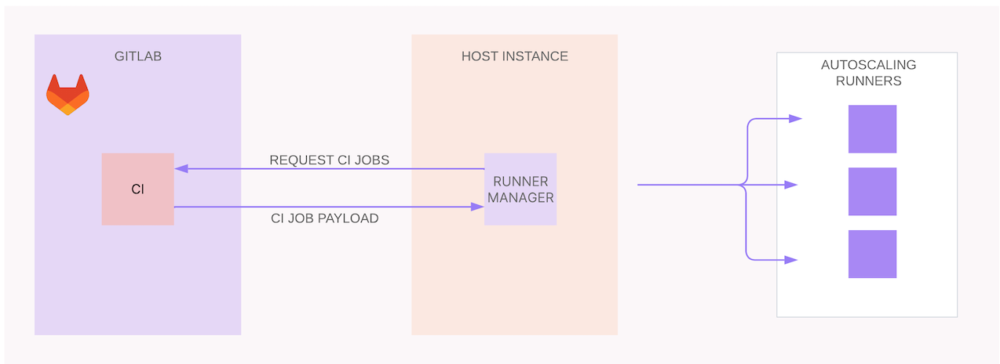

# Terraspace Project

This is a Terraspace project. 
It contains code to provision Cloud infrastructure built with 
[Terraform](https://www.terraform.io/) and the 
[Terraspace Framework](https://terraspace.cloud/).

## Overview

This project sets up a Gitlab Runner Autoscaling instance, where pipelines are 
called in an event driven manner.

## Basic Setup

There are three components to the entire architecture:

* Taskscaler
* Fleeting
* Cloud Provider Plugin

## Deploy

To deploy all the infrastructure stacks:

    terraspace all up

To deploy individual stacks:

    terraspace up demo # where demo is app/stacks/demo

## Terrafile

To use more modules, add them to the [Terrafile](https://terraspace.cloud/docs/terrafile/).

## References

- [GitHub - JerryJJ - GitLab Runner GCE](https://github.com/jerryjj/gitlab-runner-gce)
- [GitLab Docs - GitLab Runner Autoscaling](https://docs.gitlab.com/runner/runner_autoscale/)
